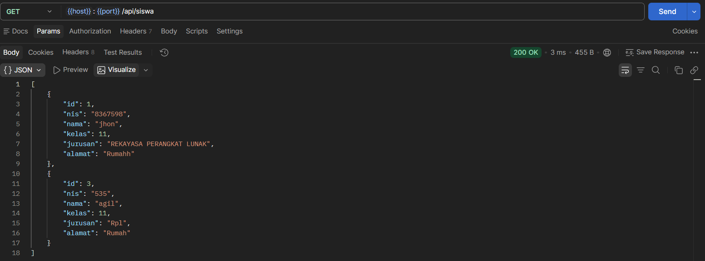
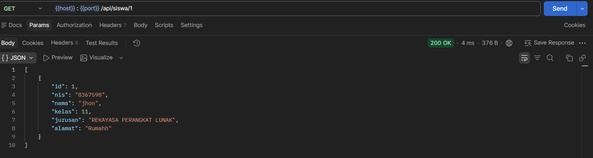
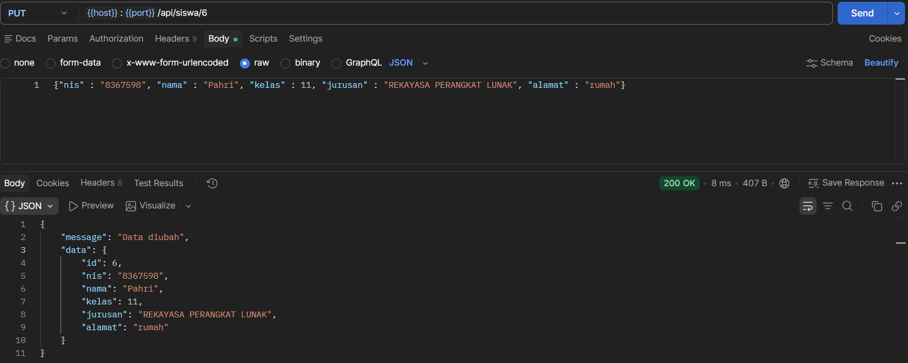
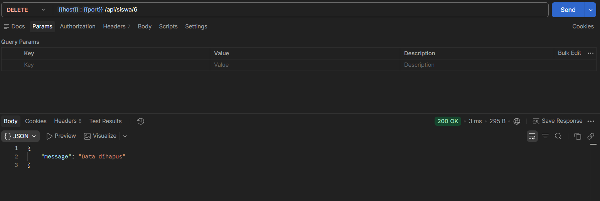

1. Nama aplikasi :
    Manajemen Data Siswa
2. Deskripsi aplikasi : 
    Sebuah aplikasi menejemen siswa yang Dapat Menampilkan Data, Menambahkan Data. Mengubah Data, Menghapus Data
3. Teknologi yang digunakan.
    BackEnd :
        Node.js/Express dan dengan testing Rest API Menggunakan POSTMAN
    Frontend :
        HTML Menggunakan Boostrap 5
    DataBase :
        MySql Meggunakan Software HeideSql Portable 12.0.6908  
4. Cara menjalankan backend.
    1. Masuk Ke Folder   
        cd Nama_Folder
    2. Install dependencies
        npm install express, nodemon, mysql2, sql2, cors
    3. Nyalakan Server
        npm start
5. Cara menjalankan frontend.
    1. masuk ke folder
        cd Nama_Folder
    2. Jalankan aplikasi frontend (atau buka file index.html jika berbasis native):
        npm run dev
6. Daftar endpoint API.
    GET /api/siswa - Menampilkan seluruh data siswa
    
    GET /api/siswa/:id - Menampilkan satu data siswa berdasarkan id
    
    POST /api/siswa - Menambahkan data siswa baru
    
    PUT /api/siswa/:id - Mengubah data siswa berdasarkan ID
    
    DELETE /api/siswa/:id - Menghapus data siswa berdasarkan ID
    
7. Screenshot aplikasi.
    .png)
8. Identitas pembuat
    Nama : Ramadhan Agil Siraj
    Kelas : 12
    Jurusan : REKAYASA PERANGKAT LUNAK
    Alamat : Griya Parung Panjang Blok c1 A No.2
    Tempat Tanggal Lahir : Bogor, 24-09-2008 
    Tinggi/Berat Badan : 170Cm/68Kg

